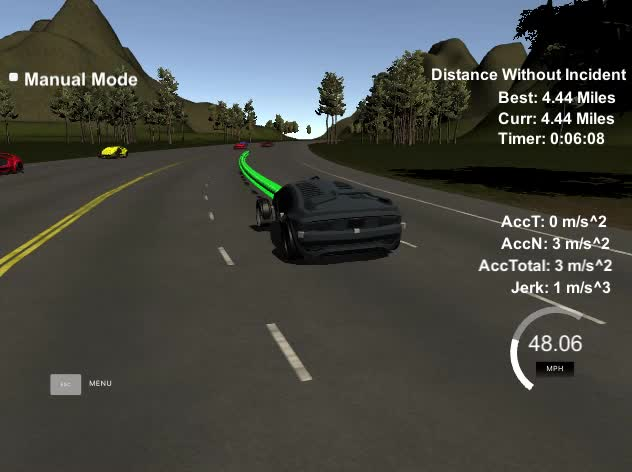

# Path Planning
Udacity Self-Driving Car Engineer Nanodegree Program

---

This project uses path planning to navigate highway traffic in a simulator, including avoiding collisions and passing slower vehicles.

A simple state machine is used to determine which action to take, between the options of keeping the speed limit, matching speed with the vehicle ahead, or changing lanes left or right. Trajectories for the chosen behavior are plotted using a spline curve that follows track waypoints, then are smoothed with a jerk minimizing polynomial.

The simulator can be downloaded from the [Udacity github repository](https://github.com/udacity/self-driving-car-sim/releases). Download the Term 3 simulator.

The supporting websockets code (using the [uWebSockets library](https://github.com/uNetworking/uWebSockets)) and project structure come from the [Udacity repository](https://github.com/udacity/CarND-Path-Planning-Project).
The README at that repository has extensive details for build and setup.

## Basic Build Instructions

1. Clone this repo.
1. `mkdir build`
1. `cd build`
1. `cmake .. && make && ./path_planning`

The resulting binary will listen on port 4567 for a websocket connection from the simulator.

## Files
[main.cpp](https://github.com/gardenermike/path-planning/blob/master/src/main.cpp) handles websocket events, and contains all of the relevant code.

[spline.h](https://github.com/gardenermike/path-planning/blob/master/src/spline.h) is a [convenient open source spline library](http://kluge.in-chemnitz.de/opensource/spline/) used for finding trajectories.

## Discussion

There are three primary components that make this software work:
1. *Mapping a spline to the waypoints provided*. There are a couple of subtleties here. Since the waypoints follow the center double yellow line, which would _not_ be a good place to drive, the waypoints are [adjusted to the appropriate lane](https://github.com/gardenermike/path-planning/blob/master/src/main.cpp#L466) by adding four meters per lane, plus an additional two meters to the center of the lane. I always begin the spline with the current vehicle position. There is nice benefit to beginning with the vehicle: the spline will automatically find a smooth path during lane changes. I do need to [increase my waypoint distance](https://github.com/gardenermike/path-planning/blob/master/src/main.cpp#L458) while changing lanes to avoid turns that are too sharp. A final subtlety is that I do not directly map to the provided waypoints, but to interpolated points between them that are a static distance from the vehicle. Keeping the waypoints further from the vehicle prevents sudden jumps when passing the mapped waypoints. The spline is created in a vehicle coordinate system with the x axis pointing forward, so that I can guarantee that the x values will always be in increasing order.
1. *Finding a trajectory along the spline*. The spline curve mapped in the initial step does not take time into account. I have a [reference meters per time step constant](https://github.com/gardenermike/path-planning/blob/master/src/main.cpp#L22) that represents a speed just under the speed limit of 50 mph. If the vehicle is below the reference speed and is not changing lanes, I add a [small increment of the difference](https://github.com/gardenermike/path-planning/blob/master/src/main.cpp#L528) at each time step. The increment is empirical, giving sufficient acceleration without excess. Similarly, if a vehicle is ahead, I find the appropriate meters per time step to equal that of the leading vehicle, [and gradually approach that velocity](https://github.com/gardenermike/path-planning/blob/master/src/main.cpp#L530). Once I have found the appropriate distance, I treated that distance as the x in the vehicle coordinate system used for the spline mapping, and simply ask the spine library for [the matching y-coordinate](https://github.com/gardenermike/path-planning/blob/master/src/main.cpp#L545). The resulting x- and y-coordinates are then transformed back into the map coordinate system and added to the trajectory points for the simulator. At each message from the simulator, I re-create the full trajectory to ensure that I am using the latest information. However, to maintain smooth continuity with the previous trajectory, I linearly [blend the remaining points](https://github.com/gardenermike/path-planning/blob/master/src/main.cpp#L554) from the previous trajectory with the new trajectory, weighting the new points heavily at the end of the trajectory, and the old points at the beginning. Finally, once I have the full trajectory built, I choose a series of points along it and [fit a new 5th degree (quintic) polynomial in both x and y to those points](https://github.com/gardenermike/path-planning/blob/master/src/main.cpp#L571). I do this to minimize jerk (change in acceleration). I found that the trickiest part of this project was to keep acceleration as smooth as possible, and this final smoothing was able to remove occasional small moments of excess change in acceleration.
1. *Using a simple state machine to choose the appropriate behavior*. The first two steps would be sufficient if there were no other vehicles on the road. But the highway in the simulator has a significant amount of traffic. To deal with other vehicles, at each message from the simulator I look through the sensor data provided by the simulator, and assign each vehicle in that data from my side of the highway [to the lane it matches most closely](https://github.com/gardenermike/path-planning/blob/master/src/main.cpp#L327). Once I have the vehicles mapped to their lanes, I [look ahead](https://github.com/gardenermike/path-planning/blob/master/src/main.cpp#L356) to see if any vehicle is closer than a fixed safe distance. If there is a slower vehicle in front of me, I change state to the "slow down" state. This state triggers a change in the target velocity in the trajectory generator, and also triggers a search for lane changes. If I am in the "slow down" state, I look into each available lane next to me, beginning with the left as the priority passing lane, and if I find no vehicles within a safe distance ahead and behind, I change to a "turn left" or "turn right" state. These states trigger a change in my target lane, which will affect the new spline ahead, as well as [setting a timestamp](https://github.com/gardenermike/path-planning/blob/master/src/main.cpp#L401), which prevents additional state changes for a couple of seconds, to avoid jerky acceleration should another opening suddenly show up. By default, the vehicle is in a "straight" state, which follows the default behavior as if there were no other vehicles on the road.

As mentioned above, the trickiest thing to get right is keeping paths smooth. Choosing states is simple logic based on external vehicle positions, and mapping a polynomial to the waypoints is also straightforward. Choosing the smoothest polynomial path, however, required a lot of fine-tuning, and was by far the most time-consuming portion of this project.

## Video
To see a full loop around the track, you can either check out a:
1. [Dramatically sped-up version in gif form](https://github.com/gardenermike/path-planning/blob/master/media/loop.gif), or
1. [The normal-speed video of a full loop on YouTube](https://youtu.be/AHCmPhP2qpQ).

Enjoy!
